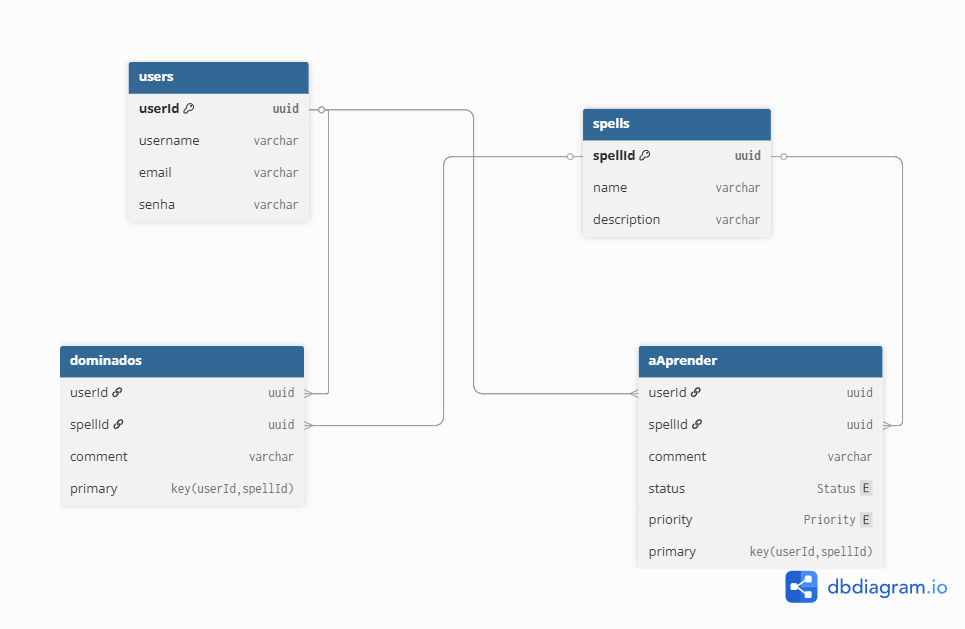

# Dominus Spellorum 🧙‍♂️

> Aplicação web que permite a usuários (personagens mágicos) gerenciar os feitiços que dominam e os que desejam aprender, usando dados da API pública de Harry Potter.

---

## ✨ Objetivo

Este projeto foi desenvolvido como parte do trabalho final da disciplina **XDES03 – Programação Web** (UNIFEI), com foco em:

- Aplicação web completa (frontend + backend)
- CRUD com arquivos como base de dados
- Autenticação com login e rotas protegidas
- Consumo de API externa (HP-API)

---

## 🧪 Funcionalidades

- Cadastro e login de usuários (Juro solenemente não fazer nada de bom!)
- Listar os feitiços dominados e a aprender de cada usuário
- Adicionar feitiços à lista de **dominados** ou **desejados**
- Editar feitiços **dominados** ou **desejados**
- Remover feitiços de ambas as listas
- Visualização personalizada por usuário
- Logout (Malfeito Feito!)

---

## 🧰 Tecnologias utilizadas

### Frontend
- Angular v(20.0.2)
- HTML/CSS
- TypeScript
- Reactive Forms
- JWT para autenticação

### Backend
- Node.js v(22.16.0)
- Express
- JSON Web Token (JWT)
- Manipulação de arquivos JSON (`fs.promises`)

### API externa
- [HP-API (Harry Potter API)](https://hp-api.onrender.com/)

---


### Como Rodar
Certifique-se de ter o Node e o Angular instalados. Este projeto foi desenvolvido com Angular 20, mas versões a partir da 15 já suportam a abordagem standalone usada aqui.
Baixe ou clone o repositório.
Para instalar as dependências, rode em ambas as pastas (front e back):

```bash
npm install
```
Para rodar o servidor express (backend):

```bash
node server.js
```

Para rodar o frontend angular:
```bash
ng serve
```
---

## 📂 Estrutura do projeto

```text
dominus-spellorum/
├── frontend/ → Aplicação Angular
├── backend/ → API Express com arquivos JSON
└── README.md


## 🗃️ Modelo Entidade-Relacionamento (MER)

Abaixo está o diagrama MER que representa as entidades e relacionamentos do Dominus Spellorum:


